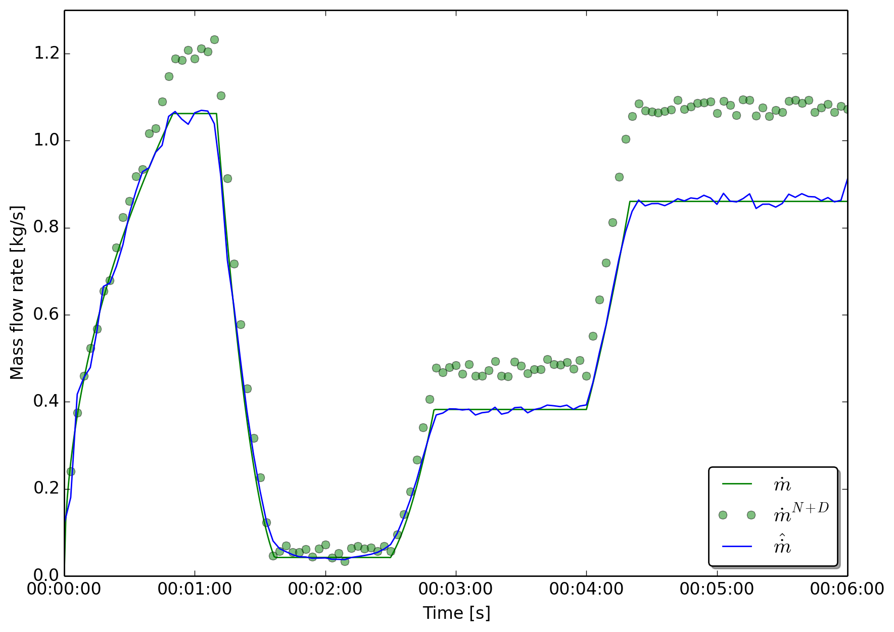
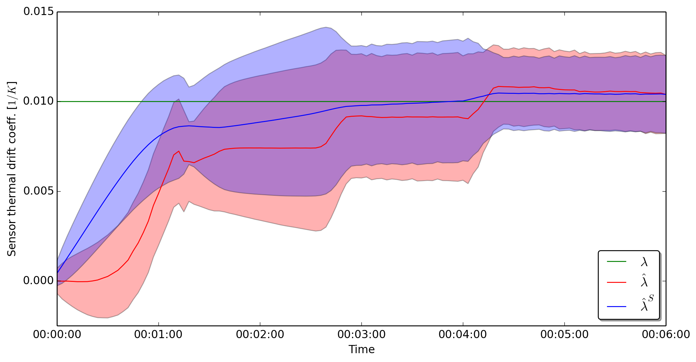

Fault detection for a valve 
===========================

This examples demonstrates how to use **EstimationPy** to identify
faults in a valve by means of state and parameter estimation.
This example has been presented in [Bonvini2014]_, please refer to this
paper for further information.

The model
+++++++++

.. image:: ../../img/valve_example/valve.png

The considered system is a valve that regulates the water flow rate in a water distribution system.
The system is described by the following equations

.. math::
	\dot{m}(t)             &= \phi(x(t)) A_v  \sqrt{\rho(t)}\sqrt{\Delta p(t)}, \\
	x(t) + \tau \dot{x}(t) &= u(t),
	:label: eqnValve
		
where :math:`\dot{m}(\cdot)` is the mass flow rate passing through the valve,
:math:`\Delta p(\cdot)` is the pressure difference across it, :math:`u(\cdot)`
is the valve opening command signal, :math:`x(\cdot)` is the valve opening position,
:math:`\tau` is the actuator time constant, :math:`\phi(\cdot)` is the power-law opening
characteristic, :math:`A_v` is the flow coefficient and :math:`\rho(\cdot)` is the fluid density
(please note that the square root of the pressure difference is regularized around zero flow
in order to prevent singularities in the solution).
The system has three sensors that respectively measure the pressure difference across the valve,
the water temperature $T(\cdot)$ and the mass flow rate passing through it. All the sensors are
affected by measurement noise. In addition, the mass flow rate sensor is also affected by a thermal drift.

.. math::
 	T^{N}(t)         &= T(t) + \eta_T(t)  \\
	\Delta p^{N}(t)  &= \Delta p(t) + \eta_P(t)  \\
	\dot{m}^{N+D}(t) &= (1 + \lambda(T(t) - T_{ref})) \dot{m}(t) + \eta_m(t)  
	:label: eqnSensors
		
The measurement equations are described in :eq:`eqnSensors`, where the superscript :math:`^N` indicates
a measurement affected by noise, the superscript :math:`^{N+D}` indicates 
the presence of both noise and thermal drift,  :math:`T_{ref}` is the reference temperature
at which the sensor has no drift, :math:`\lambda` is the thermal drift coefficient and 
:math:`\eta_{T}(\cdot)`, :math:`\eta_{P}(\cdot)`, and :math:`\eta_{m}(\cdot)` are three uniform
white noises affecting respectively the temperature, pressure and mass flow rate measurements. 
These signals are sampled every two seconds.

Suppose during the operation, at :math:`t = 80 s`, the valve becomes faulty. The fault affects the
ability of the valve to control its opening position. The valve opening cannot go below 
20% (causing a leakage) and over 60% (it gets stuck). At :math:`t = 250 s`, the valve stuck position
moves from 60% to 90%.

Filtering + smoothing
+++++++++++++++++++++

The fault identification procedure is asked to identify whether the valve not works as expected, that
is its opening position follows the command signal. The fault identification 
is performed using the UKF that uses as input signals for its model the noisy pressure difference,
the noisy water temperature and the command signal.
The command signal is noise free because it is computed by some external controller and not measured.
The UKF compares the output of its simulations with the measured mass flow rate that is 
affected by both noise and thermal drift. The effect of the thermal drift is visible in Figure (XX)
where the green dots represent the measured mass flow rate 
while the green line is the actual mass flow rate passing through the valve.

The UKF and the smother estimate the value of the state variable :math:`x(t)` representing the valve
opening position and the parameter :math:`\lambda`, the thermal drift coefficient. 
The length of the augmented state is :math:`n=2`. Hence for every estimation step,
the UKF performs :math:`1+2 \times 2=5` simulations.
The UKF has the initial conditions :math:`x(0) \sim N(1.0, 0.05)` and
:math:`\lambda \sim N(0, 0.7 \cdot 10^{-3})`, the output noise covariance matrix is :math:`R = [0.05]`,
and the filter is parametrized by the default coefficients.
Both the state and the parameter are constrained and their accepted ranges are
:math:`x(t) \in [0, 1]`, and :math:`\lambda \in [-0.005, 0.025]`.

.. literalinclude:: /../../estimationpy/examples/stuck_valve/run_ukf_smooth_fdd.py
   :language: python
   :linenos:
   :lines:  34-37, 41-108

In line 3 the model of the valve that is used for the state estimation is defined.
Lines 6-18 associates inputs from CSV files to the inputs of the FMU, while lines
21-25 associate the measured output to its relative column in the CSV file.

In lines 30-39 the state variable :math:`x(t)` is added as estimation variable, while
lines 43-52 add :math:`\lambda` to the parameters being estimated. For both state
and parameter the covariance, initial values, upper and lower boundaries are defined.

In line 65 the object representing the UKF filter and smoother is instantiated
using the valve FMu model, and in lines 68-71 the filter and smoothing
algorithm is started.
	    
Results
+++++++

The figure below shows the temperature of the water and the pressure difference across
the valve. The solid lines are the real values computed by a simulation while the dots
are the noisy measurements used by the state estimation algorithm.
	    
.. image:: ../../img/valve_example/Temp_Press.png

The image below shows the measured mass flow rate (green dots), the real mass flow rate
(solid green line), and the estimated mass flow rate computed by the smoother.
The green dots are far from the solid line because of the thermal drift of the
flow sensor.
	   

The image below shows the opening position of the valve. The green sold line is
the set point command :math:`u(t)`, while the solid red line is the actual
valve opening position :math:`x(t)`, the unknown state of the system.
The solid blue line shows the position estimated by the smoother and the blue
shaded area is the confidence interval of the estimation :math:`\hat{x}(t)`.
	   
.. image:: ../../img/valve_example/Positions.png

The image below shows how the UKF and the smoother estimate the unknown thermal
drift coefficient. The solid green line represents the unknown value of the coefficient,
while the red and blue line are the UKK and smoother estimation respectively.
It is possible to see that the state and parameter estimation algorithm is able to identify
the unknown drift coefficient.

The estimated state, that is the actual position of the valve, is then converted into a probability
of fault. The signal is compared with the desired position. Whenever the actual opening
position is bigger than the desired value the algorithm determined that the valve is leaking,
when the opening is smaller than the desired position the valve is determined to be stuck.
The red colored area identifies the exact periods in which the faults were introduced in the
simulation study. The black lines show the results of the identification using
the algorithm.
	   
.. image:: ../../img/valve_example/Probability.png

References
++++++++++

.. [Bonvini2014] *An FMI-based framework for state and parameter estimation*
         Marco Bonvini, Michael Wetter, Michael D. Sohn
	 In proceedings of 10th International Modelica Conference, 2014 - p. 647-656, Lund, Sweden
	 http://www.ep.liu.se/ecp/096/068/ecp14096068.pdf   
