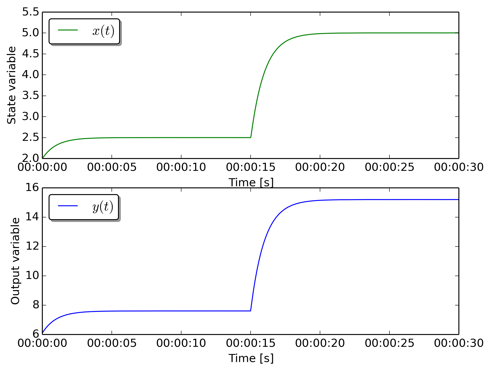

First-Order system 
==================

The example demonstrates how to use **estimationpy** to run simulations,
pools of simulations in parallel, and solve a state estimation problem.
The examples investigated here uses the following LTI
system described by equations

.. math::

    \dot{x}(t) &= ax(t) + bu(t),\\
          y(t) &= cx(t) + du(t),\\
	  x(t_0)&= x_0

where :math:`x_0=2`, :math:`a=-1`, :math:`b=2.5`, :math:`c=3`, and :math:`d=0.1`.

The model can be written in Modelica as

.. literalinclude:: /../../estimationpy/modelica/FmuExamples/FirstOrder.mo
   :language: modelica
   :linenos:

and can be exported as a Functional Mockup Unit (FMU).
This model has been exported using Dymola (Linux version, both 32 and 64 bits)
and is located in the project folder.

Run a simulation
++++++++++++++++

The first example shows how to run a simple simulation
using the FMU model.

.. literalinclude:: /../../estimationpy/examples/first_order/run_model.py
   :language: python
   :linenos:
   :lines:  14-16, 28-30, 40-50

The model is instantiated in line 2, then at line 5 the path of the
FMU file is provided.
The input data is located in a CSV file called ``SimulationData_FirstOrder.csv``.
First the input of the model is selected by its name ``u``, and its reference
is the object ``input_u``.
After, the CSV file is associated to the input variable (line 10), and the
name of the column is indicated in line 11.

The instructions at line 14 and 17 respectively initialize the model, and run the
simulation. The simulation command does not have arguments thus the time model
is simulated for the time period specified in the CSV file.
The figure below shows the result.

Run multiple simulations
++++++++++++++++++++++++

The second example shows how to run a pool of models that use
all the same FMU model.

.. literalinclude:: /../../estimationpy/examples/first_order/run_pool.py
   :language: python
   :linenos:
   :lines:  16-18, 30-59
   :emphasize-lines: 19-20, 32-33 

In this case the only difference with respect tp the previosu case is that instead
of calling directly the :func:`estimationpy.fmu_utils.model.Model.simulate` method,
we define a :class:`estimationpy.fmu_utils.fmu_pool.FmuPool` object.
Then in lines 26-30 we create 10 different initial conditions for the
state vector, and in line 33 we run the simulation. The Figure below shows
the results of the 10 different simulations that are executed in parallel.
		     
.. image:: ../../img/FirstOrderPool.png

	   
State estimation
++++++++++++++++

