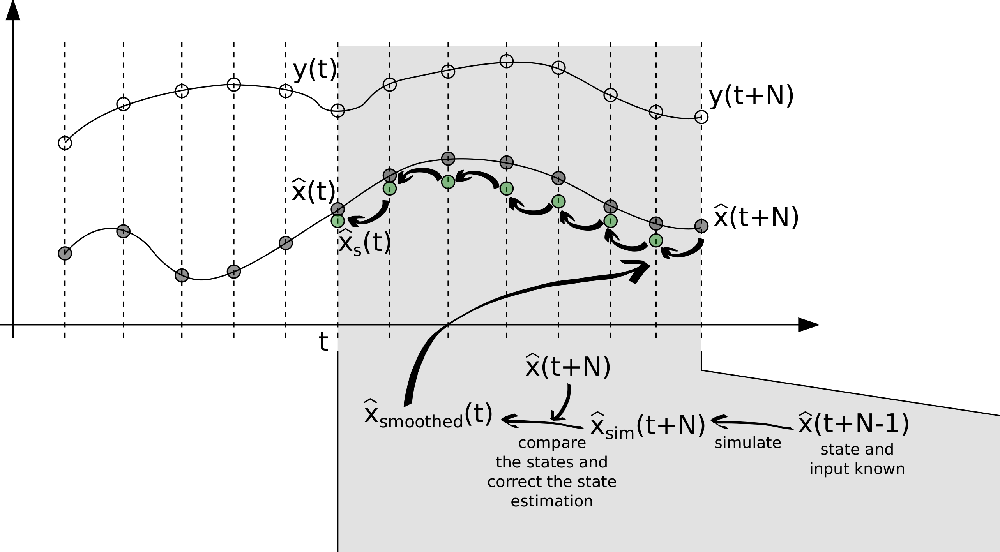

Unscented Kalman Filter and Smoother
====================================

This module contains a class that provides functionalities
for solving state estimation problems with the
Unscented Kalman Filter (UKF) and the Unscented Kalman Smoother.
The algorithm works with models that are compliant with the FMI
standard [#1]_. This documentation provides information
about the method used by the class, we suggest the interested
readers to refer to [Julier1996]_, [Julier2002]_, [Sarkka2007]_, and [Sarkka2008]_
for more information on UKF and the smoother. Also, details on
the implementation of **EstimationPy** were presented in [Bonvini2014]_.

**State Estimation**

Kalman Filter (KF) [Haykin2001]_ are often used to estimate state variables.
However, as they are only applicable for linear systems, they are not 
suited for our applications. For systems that are described by nonlinear differential equations,
the state estimation problem can be solved using an Extended 
Kalman Filter (EKF) [Haykin2001]_. The EKF linearizes around the current state estimate the original nonlinear model.
However, in some cases, this linearization introduces large errors in the estimated second order statistics
of the estimated state vector probability distribution [WanMerwe2000]_.
Another approach is to simulate sample paths that generate random points in the neighborhood of the old posterior 
probability, for example by using Monte Carlo sampling, and adopting particle filters for the
state estimation [Doucet2002]_.
These techniques are robust with respect to model nonlinearities, but they are computationally expensive.
The UKF faces the problem representing the state as a Gaussian random variable, the distribution of which is modeled
non parametrically using a set of points known as sigma points [Julier1996]_. Using the sigma points, 
i.e., by propagating a suitable number of state realizations through the state and output equations, the mean and
the covariance of the state can be captured. The favorable properties of the UKF makes its computational cost far lower
than the Monte Carlo approaches, since a limited and deterministic number of samples 
are required. Furthermore, the UKF requirements fit perfectly with the infrastructure provided by **PyFMI** since
it provides an interface to the FMU model that allows to set state variables, parameter and running simulations.  

**The Unscented Kalman Filter**

The Unscented Kalman Filter is a model based-techniques that recursively estimates the states (and with
some modifications also parameters) of a nonlinear, dynamic, discrete-time system. This system may for example represent
a building, an HVAC plant or a chiller.
The state and output equations are

.. math::
   	\begin{align}
 	\mathbf{x}(t_{k+1}) &= f(\mathbf{x}(t_k), \mathbf{u}(t_k), \Theta(t), t) + \mathbf{q}(t_k), \\
	\mathbf{y}(t_k) &= H(\mathbf{x}(t_k),\mathbf{u}(t_k), \Theta(t), t) + \mathbf{r}(t_k),
	\end{align}
	:label: eqnsStateUKF

with initial conditions :math:`\mathbf{x}(t_0) = \mathbf x_0`, where 
:math:`f \colon \Re^n \times \Re^m \times \Re^p \times \Re \to \Re^n` is nonlinear, 
:math:`\mathbf{x}(\cdot) \in \mathbb{R}^n` is the state vector, :math:`\mathbf{u}(\cdot) \in \mathbb{R}^m`
is the input vector, :math:`\Theta(\cdot) \in \mathbb{R}^p` is the parameter vector, :math:`\mathbf{q}(\cdot) \in \mathbb{R}^n`
represents the process noise (i.e. unmodeled dynamics and other uncertainties), :math:`\mathbf{y}(\cdot) \in \mathbb{R}^o`
is the output vector, :math:`H \colon \Re^n \times \Re^m \times \Re^p \times \Re \to \Re^o` 
is the output measurement function and :math:`\mathbf{r}(\cdot) \in \mathbb{R}^o` is the measurement noise.

The UKF is based on the typical prediction-correction style methods

 * PREDICTION STEP: predict the state and output at time step :math:`t_{k+1}` by using the parameters and
   states at :math:`t_{k}`.
 * CORRECTION STEP: given the measurements at time :math:`t_{k+1}`, update the posterior probability,
   or uncertainty, of the states prediction using Bayes' rule.

The original formulation of the UKF imposes some restrictions on the model because the system needs to be
described by a system of initial-value, explicit difference equations :eq:`eqnsStateUKF`. A second drawback is that the explicit
discrete time system cannot be used to simulate stiff systems efficiently.
The UKF should be translated in a form that is able to deal with continuous time models, possibly including events.

Although physical systems are often described using continuous time models, sensors routinely report
time-sampled values of the measured quantity (e.g. temperatures, pressures, positions, velocities, etc.). These
sampled signals represent the available information about the system operation and they are used 
by the UKF to compute an estimation for the state variables.

A more natural formulation of the problem is represented by the following continuous-discrete time model

.. math::
   \begin{align}
   \frac{d \ \mathbf{x}(t)}{dt} &= F(\mathbf{x}(t), \mathbf{u}(t), \Theta(t), t),  \\
   \mathbf{x}(t_0) &= \mathbf{x}_0, \\
   \mathbf{y}(t_k) &= H(\mathbf{x}(t_k),\mathbf{u}(t_k), \Theta(t),  t_k) + \mathbf{r}(t_k),
   \end{align}
   :label: eqnsState

where the model is defined in the continuous time domain, but the outputs are considered as discrete time
signals sampled at discrete time instants :math:`t_k`. 
The original problem described in equation can be easily derived as

.. math::
   \mathbf{x}(t_{k+1}) &=& f(\mathbf{x}(t_k), \mathbf{u}(t_k), \Theta(t_k), t_k) \nonumber \\
   &=& \mathbf{x}(t_k) + \int_{t_k}^{t_{k+1}} F(\mathbf{x}(t), \mathbf{u}(t), \Theta(t), t)\, dt
   :label: simulation
   
**EstimationPy** implementation uses this continuous-discrete time formulation and the numerical integration is done
using PyFMI that works with a model embedded as an FMU. Despite not shown, in :eq:`eqnsState` and :eq:`simulation`
the model may contain events that are handled by the numerical solver provided with the PyFMI package.

The UKF is based on the the Unscented Transformation [Julier1996]_ (UT), which uses a fixed (and typically
low) number of deterministically chosen sigma-points [#2]_ to express the mean and covariance of 
the original distribution of the state variables :math:`\mathbf{x}(\cdot)`, exactly, under the assumption
that the uncertainties and noise are Gaussian [Julier1996]_. 
These sigma-points are then propagated simulating the nonlinear model :eq:`eqnsState` and the mean and covariance
of the state variables are estimated from them. This is significantly different from Monte Carlo approaches because
the UKF chooses the points in a deterministic way. One of the most important 
properties of this approach is that if the prior estimation is distributed as a Gaussian random variable, the
sigma points are the minimum amount of information needed to compute the exact mean and covariance of the posterior
after the propagation through the nonlinear state function [WanMerwe2000]_.

.. figure:: ../img/StateEstimationStep.png
	    
The above Figure illustrates the filtering process which we will now explain. At time :math:`t_k`, a
measurement of the outputs :math:`\mathbf{y}(t_k)`, the inputs and the previous estimation of the state are available.
Simulations are performed starting from the prior knowledge of the state :math:`\hat{\mathbf{x}}(t_{k-1})`, 
using the input :math:`\mathbf{u}(t_{k-1})`. Once the results of the simulations :math:`\hat{x}_{sim}(t_k)` and
:math:`\hat{y}_{sim}(t_k)` are available, they are compared against the available measurements in order to correct
the state estimation. The corrected value (i.e. filtered) becomes the actual estimation. Because of its speed, the estimation 
can provide near-real-time updates, since the time spent for simulating the system and correcting the estimation is
typically shorter than the sampling time step, in particular for building or HVAC applications, where computations
take fractions of second and sampling intervals are seconds or minutes.

**Smoothing to Improve UKF Estimation**

In this subsection, we discuss an additional refinement procedure to the UKF. The distribution
:math:`P(\mathbf{x}(t_k) \vert \mathbf{y}(t_1), \dots , \mathbf{y}(t_k))` 
is the probability to observe the state vector :math:`\mathbf{x}(t_k)` at time :math:`t_k` given all the
measurements collected.
By using more data :math:`P(\mathbf{x}(t_k) \vert \mathbf{y}(t_1), \dots , \mathbf{y}(t_k), \dots \mathbf{y}(t_{k+N}))`,
the posterior distribution can be improved through recursive smoothing. Hence, the basic idea behind the recursive smoothing
process is to incorporate more measurements before providing an estimation of the state. 

The above Figure represents the smoothing process. While the filter works forwardly on the data available, and recursively
provides a state estimation, a smoothing procedure back-propagates the information obtained during the filtering
process, after some amount of data becomes available, in order to improved the estimation previously provided [Sarkka2008]_.

The smoothing process can be viewed as a delayed, but improved, estimation of the state variables.
The longer the acceptable delay, the bigger the improvement since more information can be used. For example if, at
a given time, a sensor provides a wrong measurement, the filter may not be aware of this and it may provide an estimation
that does not correspond to the real value (although the uncertainty bounds will still be correct). The smoother
observes the trend of the estimation will reduce this impact of the erroneous data, thus providing an estimation that is
less sensitive to measurement errors.

**Parameter Estimation**

The importance of the state estimation has been stressed, and we described the UKF and Smoother as solutions to this
problem. While state estimation is particularly important for controls, parameter estimation is important for model
calibration and fault detection and diagnostics. Consider, for example an heat exchanger. Suppose it is characterized
by one heat exchange coefficient that influences the heat transfer rate between the two fluids. During the 
design of the heat exchanger it is possible to compute an approximation of it. However, it is not possible to know its
value exactly. After the heat exchanger is created, identifying the value of it is important to verify if the design
requirements have been met. Another example is real-time monitoring in which it is 
continuously monitored during the operation in order to continuously check if it has been reduced by fouling and
the heat exchanger need to be serviced.

Continuous parameter estimation is possible by extending the capabilities of the UKF and Smoother to
estimate not just the state variable, but also the parameters of the system. The approach is to include the parameter
in an augmented state :math:`\mathbf{x}^A(\cdot)`, defined as

.. math::
   \mathbf{x}^A(\cdot) = \left [ \mathbf{x}(\cdot) \ \ \ \mathbf{x}^P(\cdot) \right ]^T,

where :math:`\mathbf{x}^P(\cdot) \subseteq \Theta(\cdot)` is a vector containing a subset of the full parameter
vector :math:`\Theta(\cdot)` to be estimated. The new components of the state variables need a function that
describe their dynamics. Since in the normal operation, these values are constant, the associated dynamic is

.. math::
   \frac{d \ \mathbf{x}^P(t) }{dt} = \mathbf{0},

where :math:`\mathbf{0}` is a null vector. These null dynamics have to be added :eq:`eqnsState`. The result
is a new continuous-discrete time system

.. math::
	\begin{align}
 	\frac{d \ \mathbf{x}^A(t)}{dt} &= F_A(\mathbf{x}^A(t), \mathbf{u}(t), \Theta(t), t)  \\
	\mathbf{y}(t_k) &= H(\mathbf{x}^A(t_k),\mathbf{u}(t_k), \Theta(t_k),  t_k) + \mathbf{r}(t_k),
	\end{align}

with

.. math::
    F_A(\mathbf{x}^A(t), \mathbf{u}(t), \Theta(t), t) =
    \begin{bmatrix}
    F(\mathbf{x}(t), \mathbf{u}(t), \Theta(t), t) \\
    \mathbf{0}
    \end{bmatrix}
    

Note that augmenting the state variables leads to a nonlinear state equation even if
:math:`F(\cdot, \cdot, \cdot, \cdot)` is a linear function.
Therefore, for parameter estimation, a nonlinear filtering and smoothing technique is required.

.. automodule:: estimationpy.ukf.ukf_fmu
    :members:
    :special-members:
    :private-members:

Footnotes
+++++++++

.. [#1] http://www.fmi-standard.org

.. [#2] The sigma-points can be seen as the counterpart of the particles used in Monte Carlo methods.
	
References
++++++++++

.. [Julier1996] S. J. Julier and J. K. Uhlmann.
		  A general method for approximating nonlinear transformations of probability distributions.
		  Robotics Research Group Technical Report, Department of Engineering Science,
		  University of Oxford, pages 1–27, November 1996.

.. [Haykin2001] Simon S Haykin et al.
		        Kalman filtering and neural networks.
			Wiley Online Library, 2001

.. [Doucet2002] D. Crisan and Arnaud Doucet.
		         A survey of convergence results on particle filtering methods for practitioners.
			 Signal Processing, IEEE Transactions on, 50(3):736–746, 2002.

.. [WanMerwe2000] E.A. Wan and R. Van der Merwe.
		     The unscented kalman filter for nonlinear estimation.
		     In Adaptive Systems for Signal Processing, Communications, and Control Symposium 2000.
		     AS-SPCC. The IEEE 2000, pages 153–158, 2000.
		  
.. [Julier2002] S.J. Julier.
		  The scaled unscented transformation.
		  In American Control Conference, 2002. Proceedings of the 2002,
		  volume 6, pages 4555–4559 vol.6, 2002.

.. [Sarkka2007] S. Sarkka.
		  On unscented kalman filtering for state estimation of continuous-time nonlinear systems.
		  Automatic Control, IEEE Transactions on, 52(9):1631–1641, 2007.

.. [Sarkka2008] S. Sarkka.
		  Unscented rauch–tung–striebel smoother.
		  Automatic Control, IEEE Transactions on, 53(3):845–849, 2008.

.. [Bonvini2014] Marco Bonvini, Michael Wetter, Michael D. Sohn
		  An FMI-based framework for state and parameter estimation
		  In proceedings of 10th International Modelica Conference, 2014 - p. 647-656, Lund, Sweden
		  http://www.ep.liu.se/ecp/096/068/ecp14096068.pdf
